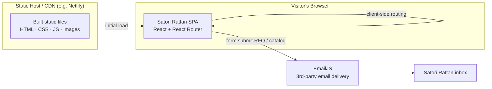

# High-Level Design (HLD) — Satori Rattan Website

**Last updated:** 2026-07
Companion docs: [BRD](./BRD.md) · [LLD](./LLD.md) · [Content Guide](./CONTENT-GUIDE.md) · [Deployment](./DEPLOYMENT.md) · [ADR](./ADR.md) · [Test Plan](./TEST-PLAN.md)

---

## 1. Architecture at a glance
A **static, client-side single-page application (SPA)**. There is **no backend
and no database**. The whole site is HTML/CSS/JS built ahead of time and served
as static files from a CDN. The only outbound interaction is to **EmailJS**
(a third-party service) to deliver form submissions as email.

## 2. Technology stack
| Layer | Choice | Why |
|-------|--------|-----|
| Language | TypeScript | Type safety |
| UI library | React 18 | Component model |
| Build tool | Vite 5 | Fast dev + optimized static build |
| Routing | React Router 7 (`createBrowserRouter`) | Client-side navigation |
| Styling | Tailwind CSS v4 (`@theme` tokens) | One consistent design system |
| Animation | Motion (`motion/react`) | Entrance + interaction animations |
| Icons | lucide-react | Icon set |
| Forms → email | EmailJS (`@emailjs/browser`) | Send email with no backend |
| Hosting | Static host / CDN (recommended: Netlify) | Global, HTTPS, zero-maintenance |

## 3. Application structure (modules)
- **Entry & shell:** `index.html` → `src/main.tsx` → `App` → `RouterProvider`.
- **Layout:** `Layout` renders the fixed `Header`, page `<Outlet/>`, `Footer`, and `ScrollToTop`.
- **Pages** (`src/app/pages/`): Home, Collections, Bespoke, Craftsmanship, About, Contact.
- **Shared components** (`src/app/components/`): Header (+ mobile drawer), Footer, Layout, ScrollToTop.
- **Shared lib** (`src/app/lib/`): `animations.ts` (shared `fadeUp`).
- **Styling** (`src/styles/`): Tailwind entry, `@theme` tokens, fonts, base resets.
- **Assets** (`public/images/`): `products/`, `pages/`, `brands/`, plus `Logo.png`.

## 4. Key data flows
### 4.1 Page navigation
Client-side via React Router (one HTML doc; JS swaps content). `public/_redirects`
(`/* /index.html 200`) makes deep links work when refreshed on a static host.

### 4.2 Lead capture (the only "write" path)
Two forms, both client-only → EmailJS (same inbox), no backend:
1. **Contact "Request for Quotation"** — full form (`Contact.tsx`).
2. **Collections "Request Full Catalog"** — short soft-gate form (`CatalogRequest` in `Collections.tsx`).

Each calls `emailjs.send(SERVICE_ID, TEMPLATE_ID, fields)`; success shows a
thank-you, failure shows an inline error. (IDs + field mapping in LLD §6.)

### 4.3 Product quick-view
Clicking a product photo opens a modal showing the full image (object-contain, so
wide sets fit), optional **color dots** or **angle gallery** thumbnails, specs, and
a "Request a Quote" link. (Detail in LLD §5.)

## 5. Cross-cutting concerns
| Concern | Approach |
|---------|----------|
| Responsive | Mobile-first Tailwind; `md:` = desktop (≥768px). No JS breakpoints. |
| Accessibility | Semantic landmarks, alt text, labeled fields, visible focus, Esc-to-close + scroll-lock on modal/drawer. |
| Performance | Static + CDN; images `loading="lazy"`. **Debt:** convert large images to WebP. |
| SEO | One `<title>`/description in `index.html`. **Debt:** per-page titles. |
| Security | Only the EmailJS **public** key in code (safe); external links `rel="noopener noreferrer"`. **Debt:** no form spam protection. |
| Theming | Tokens once in `@theme` → utility classes. |

## 6. Deployment (summary)
Static host / CDN — build `npm run build` → `dist/`; SPA routing via `_redirects`;
auto-deploy on git push; free HTTPS; no server to patch. Full steps: [DEPLOYMENT.md](./DEPLOYMENT.md).

## 7. Major design decisions (summary)
No backend · EmailJS for forms · Tailwind `@theme` tokens · static hosting over VPS ·
soft-gate lead capture · quick-view modal (not wide cards) · Projects page removed.
Rationale detail: [ADR.md](./ADR.md).
